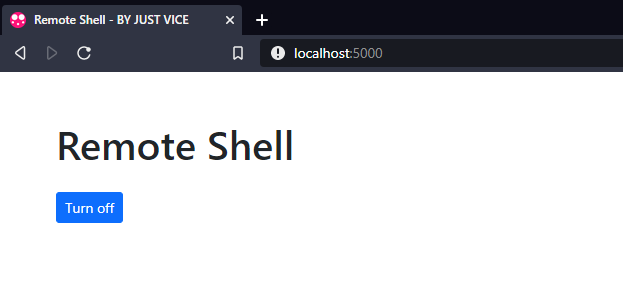

[](http://split-vice.com)

[](https://lbesson.mit-license.org/)
# Description
Remote Shell allows you to execute MsDOS commands on the computer that is serving the web application.
[Oficial website](http://split-vice.com/technology/web-software/remote-shell/)


# Technical specs
Developed in Node v12.16.2. Remote Shell needs Node to be installed on the PC to be executed. 

[Node official website](https://nodejs.org/en/)
# Web Server setup
- Install Node v12.16.2 or over <https://nodejs.org>
- Open the file ```/.env``` with a text editor and change the PORT value to desired port to run the application. Change ```TEST_MODE=TRUE``` to ```TEST_MODE=FALSE``` if the case and save changes. 
Change ```OPEN_ON_BROWSER_AUTOMATICALLY=TRUE``` if you want application to start automatically on local Internet browser when you start the application; set ```OPEN_ON_BROWSER_AUTOMATICALLY=FALSE``` otherwise.
- Run the file ```Install dependencies.bat``` to download Remote Shell's dependencies. Process terminal will close automatically when it finishes.
- Run the file ```Start Remote Shell.bat``` to execute the application.

Done!