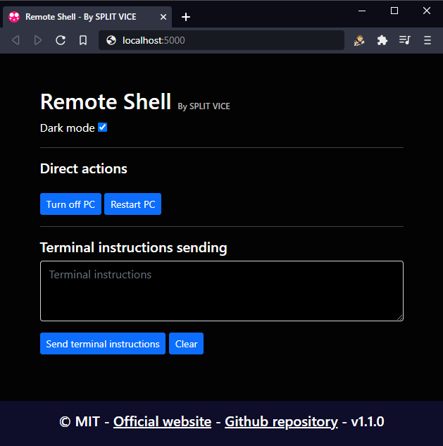

[](http://just-vice.com)

[](https://lbesson.mit-license.org/)
# Description
Remote Shell allows you to execute shell commands on the computer that is serving this web application.
[Oficial website](http://just-vice.com/technology/web-software/remote-shell/)


# Technical specs
Remote Shell needs your computer to have NodeJS. Developed in Node v12.16.2 . NodeMust be installed to run Remote Shell. [Node official website](https://nodejs.org/en/)
# Web Server setup
- Install node <https://nodejs.org>
- Open the file called ```.env``` and change the PORT value to desired port to run application. Change TEST_MODE=TRUE to TEST_MODE=FALSE if the case.
- Run the file called ```Install server.bat```.
- Run the file called ```Start server.bat```.
- The following message should be display: ```Server running on port <PORT>```. If so, the web application is successfully running.
- Go to ```localhost:<PORT>``` on your Internet browser to see the web application.

Done!